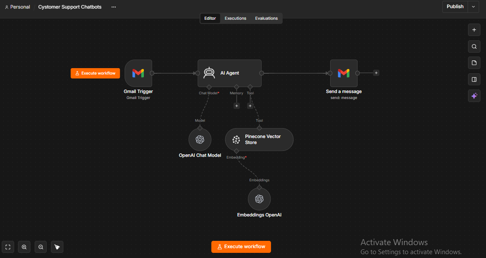

# AI Customer Support Chatbot

An AI powered customer support automation built with **n8n** that automatically processes customer emails, retrieves relevant information from a knowledge base, generates accurate responses, and replies to customers without requiring manual intervention.

---

## 🚀 Project Overview

Customer support teams often spend a significant amount of time answering repetitive questions.

This automation uses **AI + a knowledge base + email automation** to handle common customer queries automatically.

Instead of manually reading every email and writing every response, the workflow can:

**Receive → Understand → Retrieve Information → Generate Response → Reply**

---

## 🎯 Problem

Businesses receive repetitive customer questions about:

- Products and services
- Pricing
- Policies
- Delivery
- Returns and refunds
- General business information
- Frequently asked questions

Handling these manually can increase response time and consume valuable support staff hours.

---

## 💡 Solution

This workflow acts as an AI powered first-line customer support system.

When a customer sends an email, the automation:

1. Receives the incoming customer email.
2. Extracts and processes the customer's query.
3. Sends the query to an AI agent.
4. Retrieves relevant information from the business knowledge base.
5. Generates a response using the retrieved information.
6. Sends the response back to the customer via email.

---

## 🔄 Workflow



### Workflow Architecture

```text
Customer Email
      ↓
Email Trigger
      ↓
AI Agent
      ↓
Knowledge Base
      ↓
Information Retrieval
      ↓
AI Response Generation
      ↓
Email Response
      ↓
Customer
